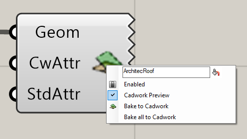
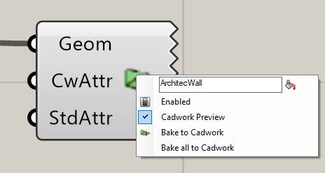
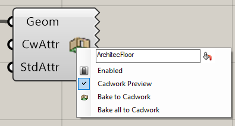
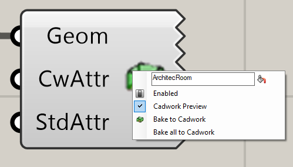

Mit den Architektur Komponenten lassen sich in cadwork Architekturelemente erstellen. 
Die Komponenten benötigen als Input eine Geometrie. Die Attribute können optional ergänzt werden. 

## Roof

{: style="width:600px"}

## Wall

{: style="width:600px"}

## Floor/Slab

{: style="width:600px"}

## Room

{: style="width:600px"}