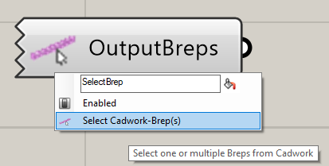
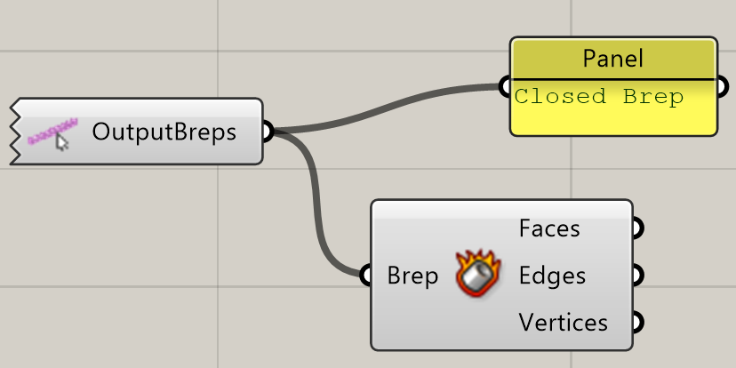
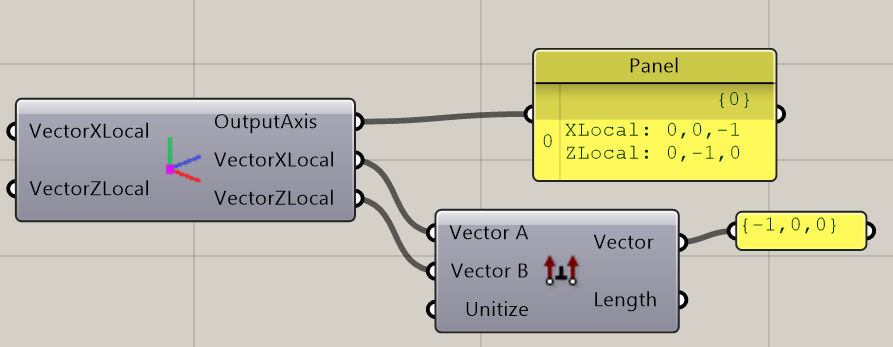
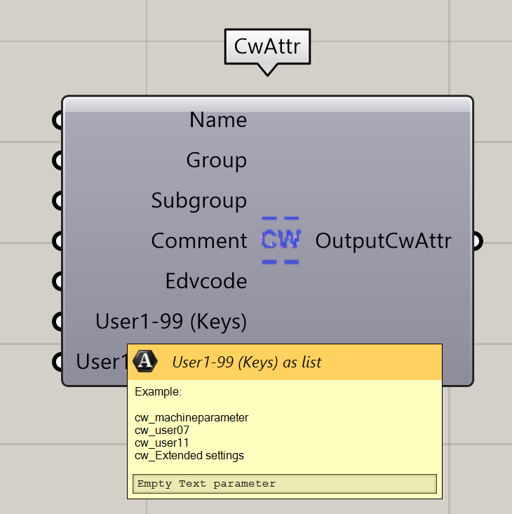
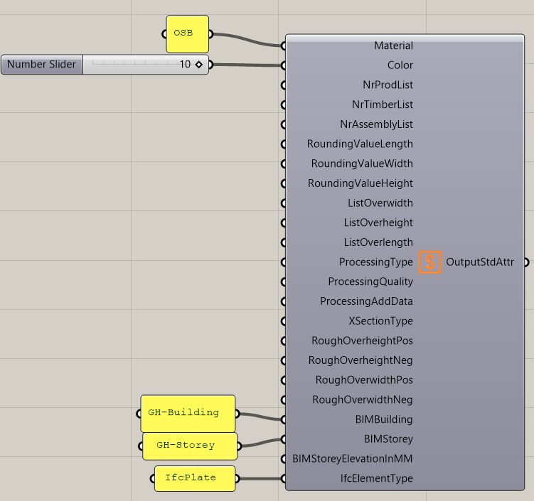

## Select Element(s)

Ein Rechtsklick auf das Icon ruft das Kontext-Menü auf. 
Mit der Funktion **Select Elements** können cadwork Elemente selektiert und mit Grasshopper verknüpft werden. 

{: style="width:600px"}

{: style="width:600px"}

Nachdem ein Bauteil mit **Select Elements** ausgewählt wurde, können die Vektoren ausgelesen werden. 

{: style="width:600px"}

## Bauteilachsen

Lokale Bauteilachsen werden über die **Axis** Komponente definiert. 
Es wird ein X-, sowie ein Z-Vector angegeben. 

{: style="width:600px"}

## User Attribute

{: style="width:600px"}

## Standard Attribute

{: style="width:600px"}