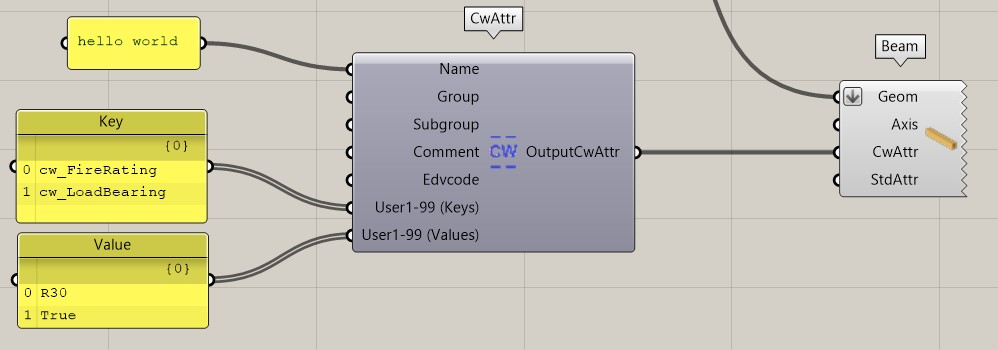
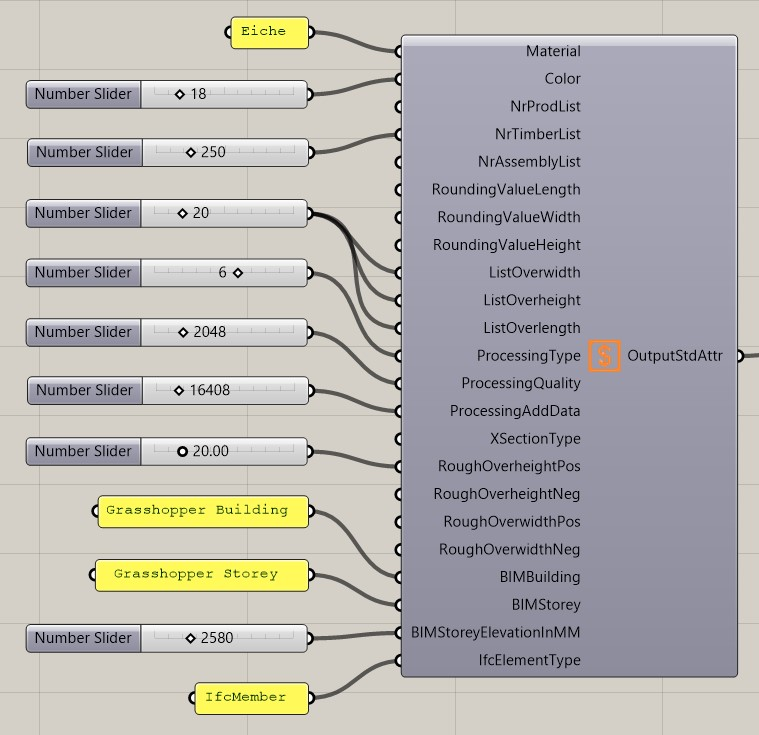
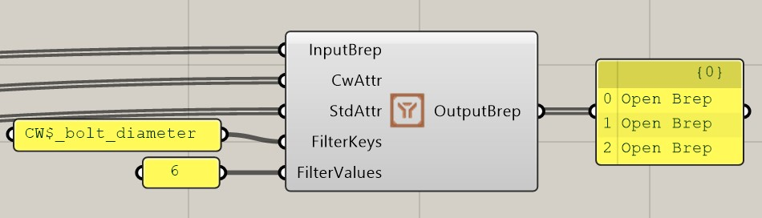
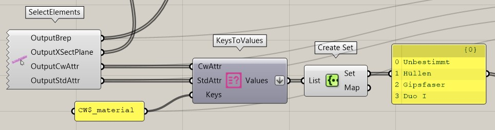
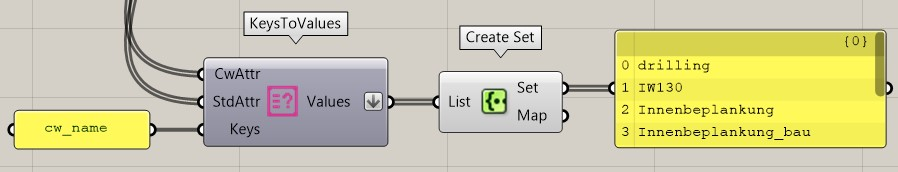

## User Attribute

Für die cadwork Elemente lassen sich User Attribute erstellen. Diese können als Inputparameter hinzugefügt werden. 

{: style="width:600px"}

Input           | comment 
----------------|:---------
Name | String
Group | String
Subgroup | String
Comment | String
Edvcode | String
User1-99 (Keys) | String  **Name des Attributs muss in cadwork vorhanden sein**.  Um das Attribut via Grasshopper zu erstellen muss das **Prefix cw_** vorangesetzt werden.
User1-99 (Values) | String 

Output           | comment 
-----------------|:---------
OutputStdAttr | Rückgabe der erstellen cadwork Attribute

## Standard Attribute

{: style="width:600px"}

Input           | Rückgabewert 
-----------------|:---------
Material | Materialname
Color | Farbnummer
NrProdList | Produktionslisten-Nummer
NrTimberList | Stücklisten-Nummer
NrAssemlbyList | Montagelisten-Nummer
RoundingValueLength | Rundungswert Länge [mm]
RoundingValueWidth | Rundungswert Breite [mm]
RoundingValueHeight | Rundungswert Höhe [mm]
ListOverwidth | Breite roh [mm]
ListOverheight | Höhe roh [mm]
ListOverlength | Länge roh [mm]
ProcessingType | Ausgabeart
ProcessingQuality | Bearbeitungsqualität
ProcessingAddData | Zusatzeinstellungen
RoughOverheightPos | Positive Höhenachse [mm]
RoughOverheightNeg | Negative Höhenachse [mm]
RoughOverwidthPos | Positive Breitenachse [mm]
RoughOverwidthNeg | Negative Breitenachse [mm]
BIMBuilding | Gebäude
BIMStorey | Geschoss 
BimStoreyEleveationInMM | Geschosshöhe in [mm]
IfcElementType | IfcTyp (z.B. IfcMember)

Output           | comment 
-----------------|:---------
OutputCwAttr | Rückgabe der erstellen cadwork Attribute

## Filter by Attribute

Brep's lassen sich über diese Komponente nach definierten Keys/Values filtern. 

Input           | comment 
-----------------|:---------
InputBrep | Brep's
CwAttr | cadwork Attribute
StdAttr | Standard Attribute
FilterKeys | Filter Keys   Schreibweise beachten   :white_check_mark: **CW$_foo_bar**
FilterValues | Wert nach dem gefiltert werden soll

Output           | comment 
-----------------|:---------
OutputBrep | Rückgabe der gefilterten Brep

## Keys to Values
Attributwerte nach gegebenen Schlüsseln abrufen.

Filter nach Standardattribute

Filter nach Userattributen

Input           | comment 
-----------------|:---------
CwAttr | cadwork Attribute
StdAttr | Standard Attribute
Keys | Schlüssel nach dem gefiltert werden soll   Präfix beachten!  :white_check_mark: **StdAttr CW$_**   :white_check_mark: **CwAttr cw_**

Output           | comment 
-----------------|:---------
OutputBrep | Rückgabe der gefilterten Brep

## Working with Standard Attributes 

### Output Standard-Attribute
Name           | Rückgabewert 
-----------------|:---------
CW$_material | String
CW$_color | Integer
CW$_number_production_list | Integer
CW$_number_timber_list | Integer
CW$_number_assembly_list | Integer
CW$_rounding_value_width | Real
CW$_rounding_value_height | Real
CW$_rounding_value_length | Real
CW$_list_overwidth | Real
CW$_list_overheight | Real
CW$_list_overlength | Real
CW$_processing_type | Integer
CW$_processing_quality | Integer
CW$_processing_add_data | Integer
CW$_xsection_type | Integer
CW$_rough_overheight_pos | Real
CW$_rough_overheight_neg | Real
CW$_rough_overwidth_pos | Real
CW$_rough_overwidth_neg | Real
CW$_BIMBuilding | String
CW$_BIMStorey | String 
CW$_IfcElementType | String

### ProcessingType
Name           | Nummer (Integer) 
-----------------|:---------
Keine Ausgabeart | 0
Sparren | 1
Pfette | 2
Schifter | 3
Blockbohle | 4
Stiel | 6
Binder | 7
Grat/Kehlsparren | 11
User 1 | 20
User 2 | 21
User 3 | 22
User 4 | 23
User 5 | 24
Stufe | 30
Platte 1 | 120
Platte 2 | 121
Platte 3 | 122
Platte 4 | 123
Platte 5 | 124

### ProcessingQuality
Name           | Nummer (Integer) 
-----------------|:---------
None | 0
Kerve | 1
Herzkerve | 2
Blatt | 4
Firstblatt | 8
Gerberstoss | 16
Versatz | 32
Bohrung | 64
Profil | 128
Schlitz | 256
Traufschalung | 512
Hakenblatt | 1024
Stirnnut | 2048
SS-Nut innen | 4096
SS-Nut aussen | 8192
Hexenschnitt | 16348
HobelnGesamt | 32768

### ProcessingAddData
Name           | Nummer (Integer) 
-----------------|:---------
Keine | 0
Ausgabe ESZ einzeln | 16393
Ausgabe ESZ Wand | 16396
Referenz Container | 16408
Multifunktionsbrücke | 16424
Rundholzmakro in BVN | 16904
Bearbeitung im Einzelbauteil | 16520
Für VBA ignorieren | 18440
Alle | 19133

### XSectionType

Name           | Nummer (Integer) | comment
-----------------|:---------
Quadratischer Querrsch. | 1 | 
Rechteckiger Querschnitt | 2 | 
Runder Querschnitt | 3 | 
Platte Rechteck | 17 | 
Metall | 1000 | Achtung! Dieser SectionType darf nur  für in cadwork erstellten Metallprofilen verwendet werden.
