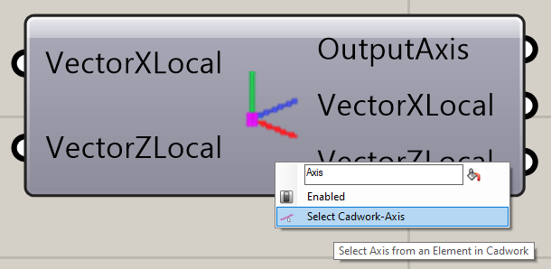

## Get BREP

A right click on the icon calls the context menu. 
With the function **Select Cadwork-Brep(s)** cadwork elements can be selected. 

{: style="width:600px"}

{: style="width:600px"}

## Component Axis

Local component axes are defined via the **Axis** component. 
An X vector and a Z vector are specified. 

{: style="width:600px"}

With a right click on the icon the option **Select-Cadwork Axis** can be selected in the context menu. This enables the reading of component axes. 

{: style="width:600px"}

After selecting a part with **Select Cadwork-Axis**, the vectors can be read. 

{: style="width:600px"}

## User Attributes

{: style="width:600px"}

## Standard Attributes

{: style="width:600px"}