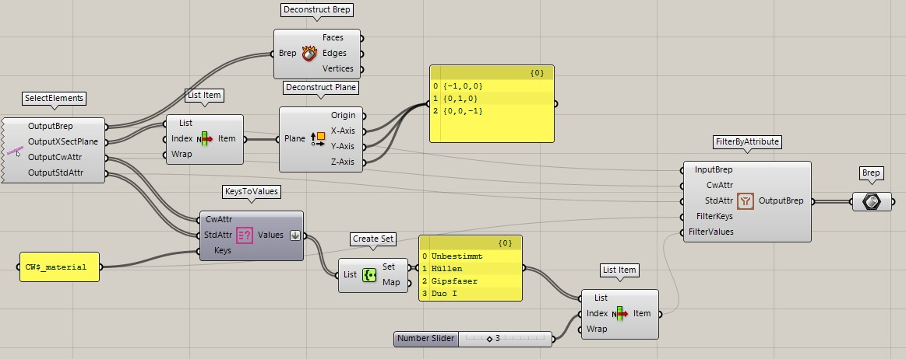

## Select Element(s)

Ein Rechtsklick auf das Icon ruft das Kontext-Menü auf. 
Mit der Funktion **Select Elements** können cadwork Elemente selektiert und mit Grasshopper verknüpft werden. 

{: style="width:600px"}

Input           | comment 
----------------|:---------
None | Elemente via Kontext Menü wählen/hinzufügen

Output           | comment 
-----------------|:---------
OutputBrep | Rückgabe der Elemente in einer Liste
OutputXSectPlane | Rückgabe der XY Ebene
OutputCwAttr | Rückgabe der user Attribute
OutputStdAttr | Rückgabe der standard Attribute

