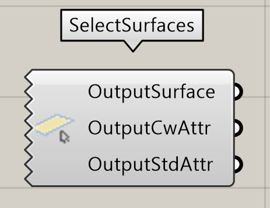
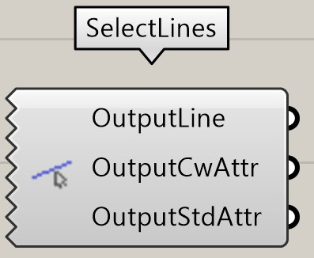
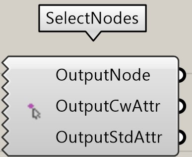

## Select Element(s)

Un clic droit sur l'icône appelle le menu contextuel. 
La fonction **Select Elements** permet de sélectionner des éléments cadwork Brep (barre, plaque, volume auxiliaire, boulon) et de les lier à Grasshopper. 

{: style="width:600px"}

Input           | comment 
----------------|:---------
None | Sélectionner/ajouter des éléments via le menu contextuel

Output           | comment 
-----------------|:---------
OutputBrep | Retour des éléments dans une liste
OutputXSectPlane | Restitution du niveau XY
OutputCwAttr | Retour des attributs utilisateur
OutputStdAttr | Retour des attributs standard

## Select Surface(s)

Un clic droit sur l'icône fait apparaître le menu contextuel. 
La fonction **Select Elements** permet de sélectionner des surfaces et de les lier à Grasshopper. 

Input           | comment 
----------------|:---------
None | Sélectionner/ajouter des éléments via le menu contextuel

Output           | comment 
-----------------|:---------
OutputSurface| Retour des éléments dans une liste
OutputCwAttr | Retour des attributs utilisateur
OutputStdAttr | Retour des attributs standard

## Select Line(s)

Un clic droit sur l'icône fait apparaître le menu contextuel. 
La fonction **Select Elements** permet de sélectionner des lignes et de les lier à Grasshopper. 

Input           | comment 
----------------|:---------
None | Sélectionner/ajouter des éléments via le menu contextuel

Output           | comment 
-----------------|:---------
OutputLine | Retour des éléments dans une liste
OutputCwAttr | Retour des attributs utilisateur
OutputStdAttr | Retour des attributs standard

## Select Node(s)

Un clic droit sur l'icône fait apparaître le menu contextuel. 
La fonction **Select Elements** permet de sélectionner des nœuds et de les associer à Grasshopper. 

Input           | comment 
----------------|:---------
None | Sélectionner/ajouter des éléments via le menu contextuel

Output           | comment 
-----------------|:---------
OutputNode | Retour des éléments dans une liste
OutputCwAttr | Retour des attributs utilisateur
OutputStdAttr | Retour des attributs standard