The following components enable the generation of cadwork elements. The elements are displayed as locked elements in cadwork. As soon as the elements are "baked", the locking is removed. Baking is done via the context menu.

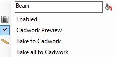{: style="width:300px"}

**Bake all to cadwork** unlocks all elements created with Grasshopper (unlocks the elements). 

## Beam

The **Beam** component generates a beam in cadwork. 
In addition to the mandatory geometry input, the options **Axis, CwAttr, StdAttr** are optionally available. 

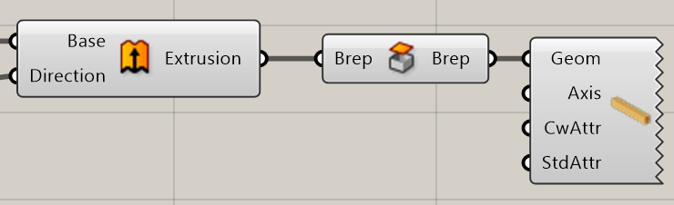{: style="width:600px"}

Input           | comment 
----------------|:---------
Geom | Brep closed
Axis | Axis system [optional]
CwAttr | Userattributes [optional]
StdAttr | Standardattributes [optional]

Output           | comment 
-----------------|:---------
None | Element is generated in cadwork

With a right click on the icon the option **Cadwork Preview, Bake to Cadwork, Bake all to Cadwork** can be selected in the context menu. This allows to read out part axes. 
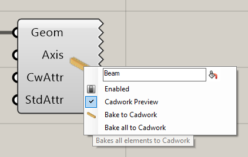{: style="width:600px"}

## Panel

The **Panel** component generates a panel in cadwork.
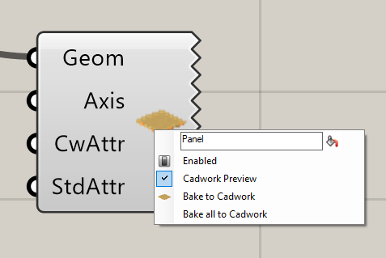{: style="width:600px"}

Input           | comment 
----------------|:---------
Geom | Brep closed
Axis | Axis system [optional]
CwAttr | Userattributes [optional]
StdAttr | Standardattributes [optional]

Output           | comment 
-----------------|:---------
None | Element is generated in cadwork

## Auxiliary Element

The **AuxVol** component generates an auxiliary volume in cadwork.
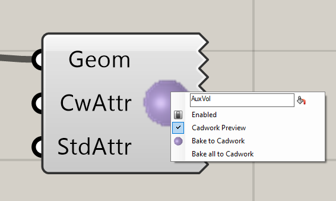{: style="width:600px"}

Input           | comment 
----------------|:---------
Geom | Brep closed
CwAttr | Userattributes [optional]
StdAttr | Standardattributes [optional]

Output           | comment 
-----------------|:---------
None | Element is generated in cadwork

## Drilling

The **Drilling** component generates a bolt in cadwork. The components needs as input a **Point 1, Point 2, Diameter**. The **Drilling allowance as well as the attributes** can be added optionally. 

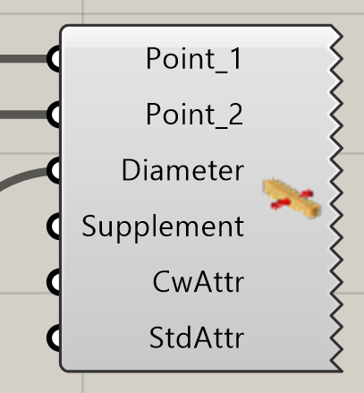{: style="width:600px"}

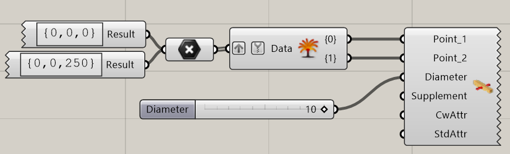{: style="width:600px"}

Input           | comment 
----------------|:---------
Point_1 | Start Point
Point_2 | End Point
Diameter [mm] | Supplement Drilling [mm]
CwAttr | Standard Attributes
StdAttr | Standard Attributes 

Output           | comment 
-----------------|:---------
None | Element is generated in cadwork

## Bauteilachsen

Local component axes are defined via the **Axis** component. 
An X vector and a Z vector are specified. 

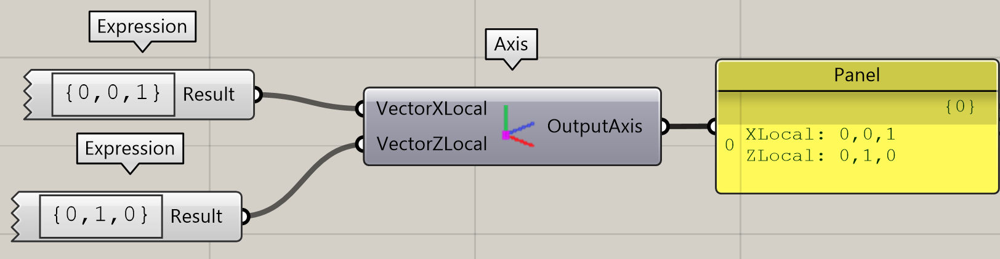{: style="width:600px"}

Input           | comment 
----------------|:---------
VectorXLocal | {x, y, z}
VectorYLocal | {x, y, z}

Output           | comment 
-----------------|:---------
OutputAxis | Return of the cadwork plane

## Create Surface

The **AuxVol** component generates an auxiliary volume in cadwork.
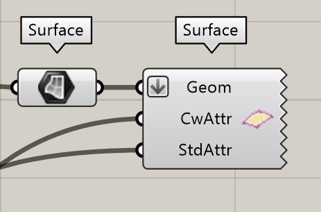{: style="width:600px"}

Input           | comment 
----------------|:---------
Geom | Surface
CwAttr | Userattributes [optional]
StdAttr | Standardattributes [optional]

Output           | comment 
-----------------|:---------
None | Element is generated in cadwork

## Create Line

The **AuxVol** component generates an auxiliary volume in cadwork.
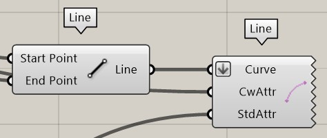{: style="width:600px"}

Input           | comment 
----------------|:---------
Geom | Line
CwAttr | Userattributes [optional]
StdAttr | Standardattributes [optional]

Output           | comment 
-----------------|:---------
None | Element is generated in cadwork

## Create Node

The **AuxVol** component generates an auxiliary volume in cadwork.
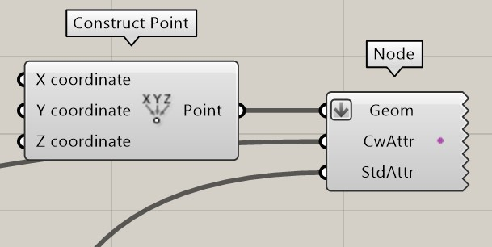{: style="width:600px"}

Input           | comment 
----------------|:---------
Geom | Point
CwAttr | Userattributes [optional]
StdAttr | Standardattributes [optional]

Output           | comment 
-----------------|:---------
None | Element is generated in cadwork