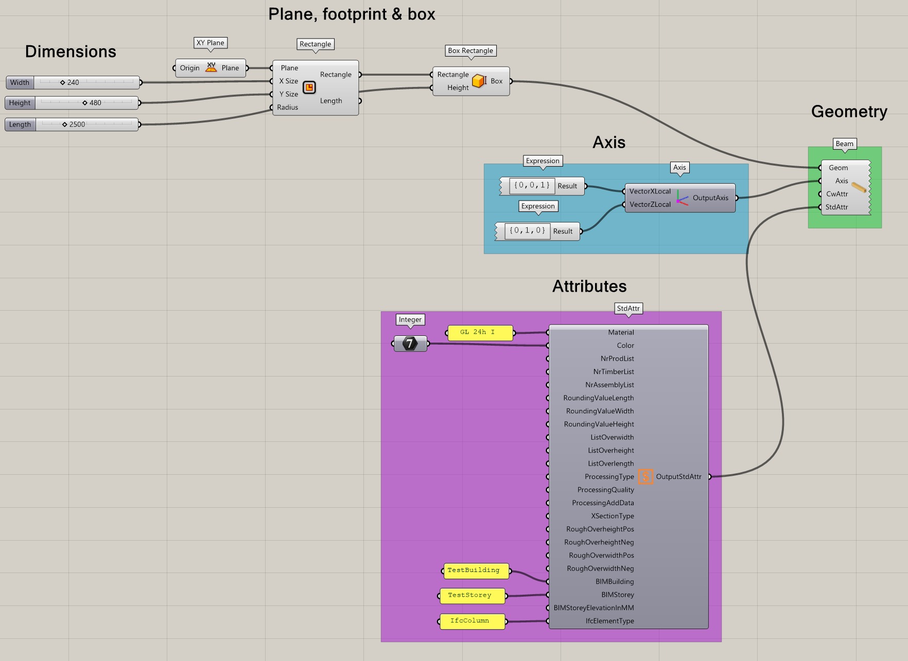
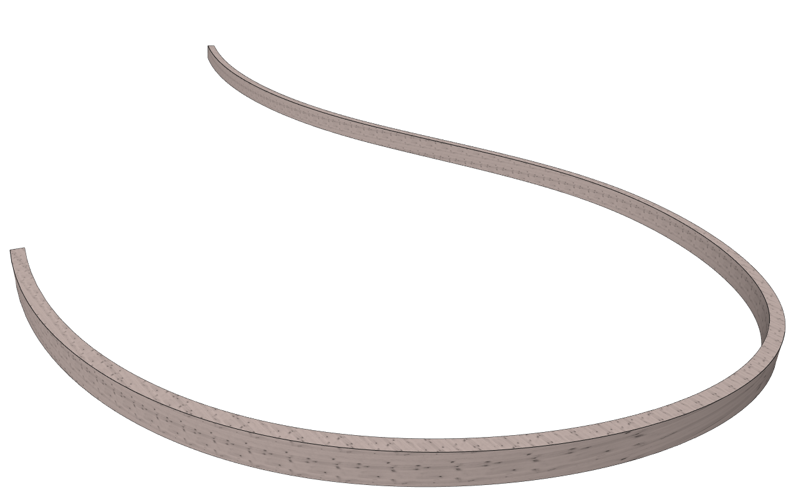
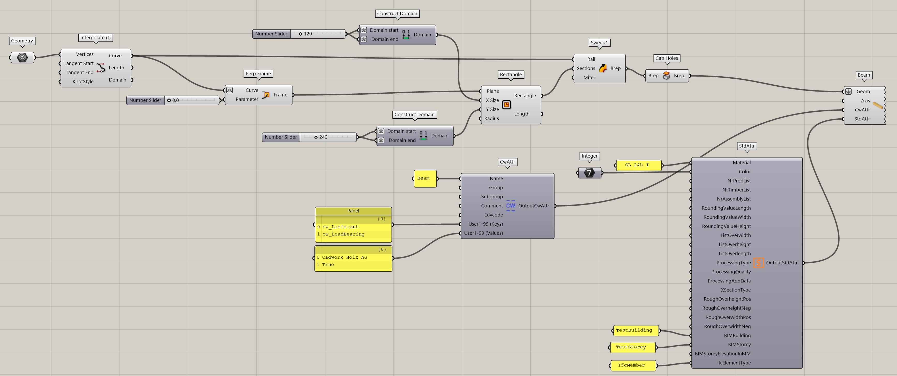

# Beispiele

## Definition eines Stab rechteckig

[Download - Beispiel aus GitHub Repo](https://github.com/Brunner246/RhinoInsideCadwork/tree/main/gh-examples)

## Definition eines Sweep - Stab rechteckig

[Download - Beispiel aus GitHub Repo](https://github.com/Brunner246/RhinoInsideCadwork/tree/main/gh-examples)

