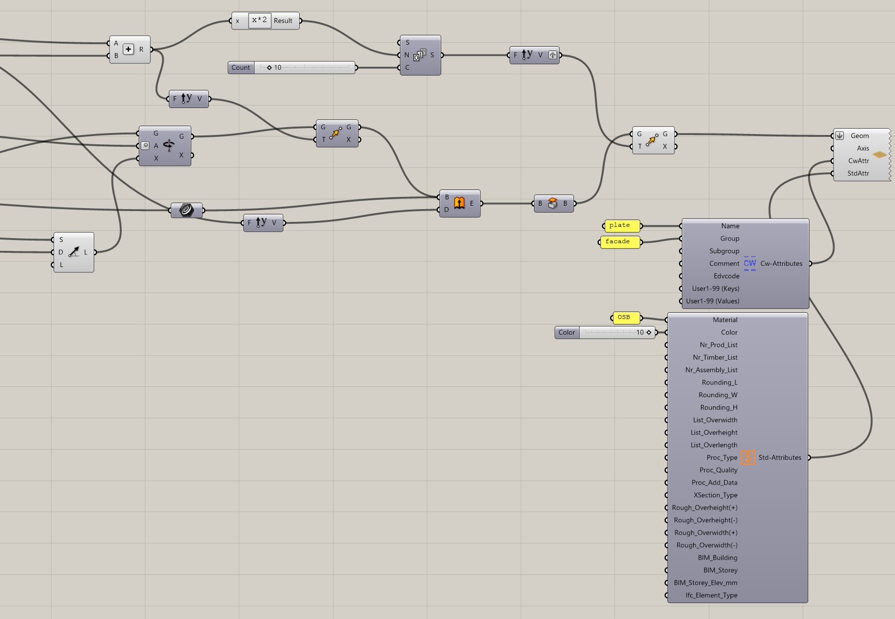
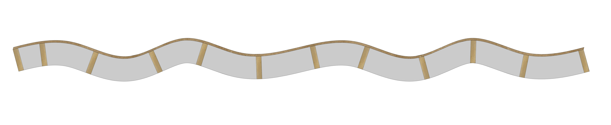
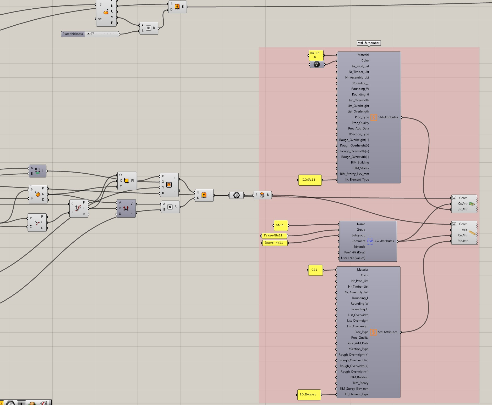

# Examples

## Create a beam rectangular

[Download - Beispiel aus GitHub Repo](https://github.com/Brunner246/RhinoInsideCadwork/tree/main/gh-examples)

## Sweep - beam rectangular

[Download - Beispiel aus GitHub Repo](https://github.com/Brunner246/RhinoInsideCadwork/tree/main/gh-examples)

## Sine plates

[Download - Beispiel aus GitHub Repo](https://github.com/Brunner246/RhinoInsideCadwork/tree/main/gh-examples)

## Framed wall sine shape

[Download - Beispiel aus GitHub Repo](https://github.com/Brunner246/RhinoInsideCadwork/tree/main/gh-examples)

