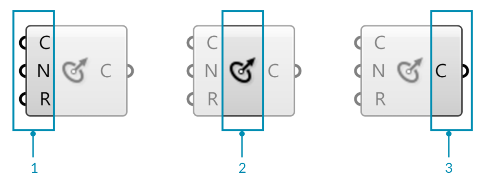
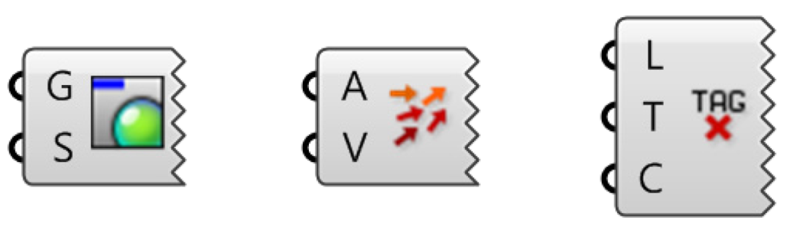
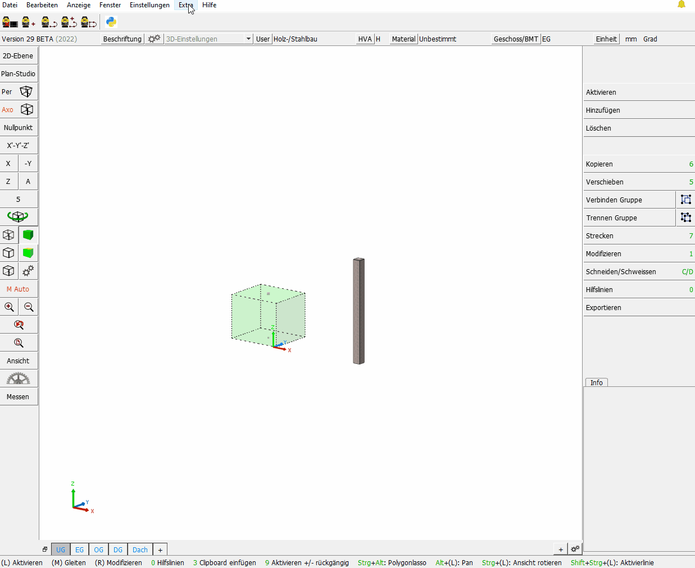
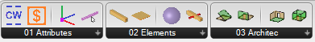
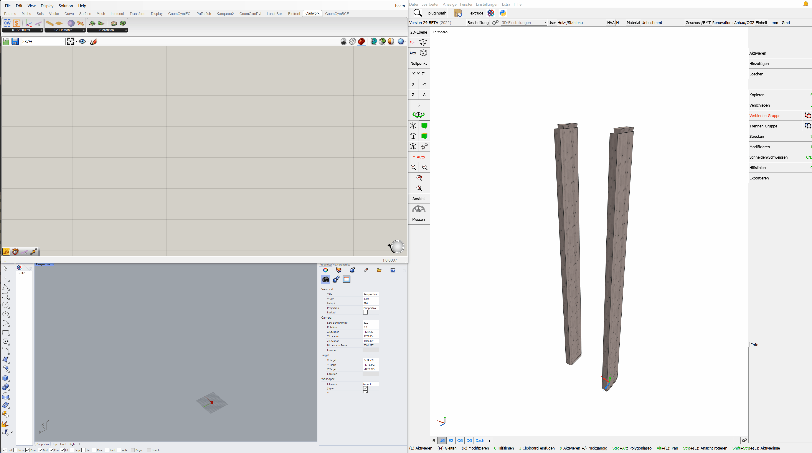

# Welcome to RhinoInsideCadwork
 
 

 
 
 
 

RhinoInsideCadwork is a tool that allows you to embed Rhino 7 in cadwork 3D. Take advantage of the surface modeler in your cadwork 3D environment. 

## Add-on Download

[food4Rhino - RHINOINSIDE FOR CADWORK 3D](https://www.food4rhino.com/en/app/rhinoinside-cadwork-3d?lang=de)

Food4Rhino is McNeel's community service for plug-ins. Users can find the latest Rhino plug-ins, Grasshopper add-ons, scripts and much more. Moreover, they can contact developers and share their applications.

<iframe width="560" height="315" src="https://www.youtube.com/embed/vBh1UHg6ZHQ" title="YouTube video player" frameborder="0" allow="accelerometer; autoplay; clipboard-write; encrypted-media; gyroscope; picture-in-picture" allowfullscreen></iframe>

## Grasshopper

Grasshopper :cricket: is a graphical algorithm editor that integrates with Rhino3D modeling tools. You use Grasshopper to design algorithms that then automate tasks in Rhino3D.
Grasshopper's visual "plug-and-play" style gives designers the ability to combine creative problem solving with novel control systems through the use of a fluid graphical interface.

{: style="width:800px"}

> 1. The three input parameters of the Circle CNR component.
> 2. The circle CNR component area.
> 3. The output parameter of the Circle CNR component.

A component needs data to perform its actions, and it usually produces a result. For this reason, most components have a set of nested parameters called inputs and outputs, respectively. The input parameters are on the left side, and the output parameters are on the right side.

There are a few Grasshopper components that have inputs but no outputs, or vice versa. If a component has no inputs or outputs, it has a jagged edge.

{: style="width:800px"}

## Run RhinoInsideCadwork

RhinoInsideCadwork :rhinoceros: is started via **Extra -> Rhino Live Link**. 

{: style="width:900px"}

## Komponenten

The components are divided into four sections.  
The **Attributes** section contains components for handling attributes. 
Im Abschnitt **Select** finden sie alle Komponeten zur Selektierung von cadwork Elementen.  
In the **Create Elements** section you can find the components for creating cadwork elements.  
The last section **Architecture** contains components for creating architectural elements. 

### Kontext-Menü

Some components offer functionalities via the context menu. The context menu is called up by right-clicking on the icon.  

Via the context menu you can

* Select Cadwork Elements
* Preview 
* Bake Elements  

control. 

